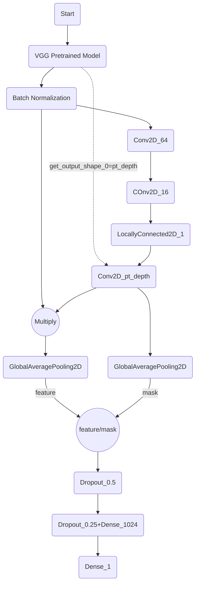

## RSNABaseline.py

***

#### Use zscore as labels

* How to caculate zscore

  ```py
  mean = dataframe['attr_name'].mean()
  div = dataframe['attr_name'].std()
  dataframe['zscore'] = dataframe['attr_name'].map(lambda x: (x - mean)/div)
  ```

* Categorize the attribute of dataframe

  ```python
  pd.cut(dataframe['attr_name'], interval)
  ```

* Get training set and testing set based on a balanced distribution of labels

  ```python
  train_test_split(..., stratify=dataframe['label_category'])
  ```

* Regroup training set by cluster the data with the same category

  ```python
  dataframe.groupby(['category1', 'category2']).apply(lambda x:x.sample(n, replace=True)).reset_index(drop=True)
  # replace = True necessary when the number of a certain satisfied category is less than n.
  # drop = True drop the original index
  # groupby operation use category1, and category2 as index
  ```

  ***

#### Apply Attention Model



***

#### How to operate a certain layer

* To get the size of a certain layer

  ```python
  model.get_output_shape(i)[j]
  ```

* To get the output of a certain layer

  ```pyt
  model.get_layer(name='layer_name').output
  ```

  ***

#### Various ways to combine different layers

* To multiply outputs of 2 layers

  ```python
  multiply([layer1, layer2])
  ```

* To rescale of outputs of 2 layers

  ```py
  Lambda(lambda x: x[0]/x[1], name='name')([denominator, nominator])
  ```

  ***

#### To modify the metrics of a model using zscore as labels

* ```python
  model.compile(optimizer='', loss='', metrics=[mae])
  
  def mae(in_gt, in_pred):
      return mae(div*in_gt, div*in_pred)
  ```

  

